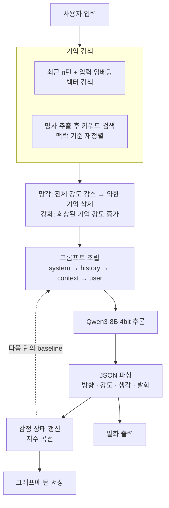

# Human — 아이(AI)

**기억·감정·호불호를 축적하면서 행동이 달라지는 AI를 만들어보려 한 실험**

`실험 종료 · 2026.02 · 미완성`

> [!NOTE]
> 이 README와 [docs/](docs/)의 기록은 개발 당시의 개인 일지와 git 기록, 소스 코드, 세션 로그를 바탕으로 **AI가 작성했다.**
> 설계·판단·파라미터 조정은 개발자 본인의 것이고, 문서화와 로그 재집계는 AI의 작업이다. → [제작 노트](docs/실험기록.md#제작-노트)

---

일지 서두에 적은 목표는 이렇다.

> LLM이 사람을 흉내내는 게 아니라, **기억·감정·호불호를 축적하면서 행동이 달라지는 AI**를 만드는 것

코드에서 감정은 파이프라인이 들고 있는 상태 변수이고, 기억은 Neo4j 그래프에 저장된다. 매 턴 그 둘을 프롬프트에 주입한다. 일지의 표현으로는 **AI의 내면을 가중치가 아니라 기억 그래프에 두는 구조**다.

미완성으로 중단했다. 일지와 로그에 남은 결과는 아래 표에 있다.

## 한 턴의 흐름

## 핵심 설계 세 가지

**감정은 연기용 텍스트가 아니라 상태다.** 일지에는 감정이 "연기용 텍스트"가 아니라 행동을 조절하는 파라미터여야 한다고 적었다. 코드에서 모델은 이번 턴의 감정 변화 방향과 강도를 보고하고, 상태 갱신은 코드가 한다. 갱신된 값은 다음 턴 입력으로 들어간다.

**기억은 그래프에 두고, 잊게 만든다.** 모든 대화를 저장하되 노드마다 기억 강도를 두고 매 턴 감소시킨다. 회상되면 강해지고 임계값 아래로 내려가면 삭제되며, 삭제할 때는 앞뒤 노드를 다시 잇는다. 강도가 낮아지면 기억에 붙는 시각도 분 → 시 → 일 → 월로 줄어든다.

**강화학습을 뒤로 미뤘다.** 일지에는 벌점이 "부정적 경험 → 안함"으로 작동해 이유를 남기지 않고, 부정적 감정에 벌점을 주면 학습 후기에는 부정적 감정을 표출하지 못하는 상황이 만들어질 가능성이 크다고 적었다. 원한 것은 부정적 감정을 느끼되 그 상황을 회피하는 AI였다. 일지 마지막에는 "현재 강화학습을 넣는것은 이르다"고 보고, 기존 기억 검색을 강화해 회피·배움 현상이 발생하는지 먼저 확인하기로 했다.

## 결과

| 의도한 것 | 일지·코드·로그에 남은 결과 |
|---|---|
| 기억 기반 호불호 표출 | 2/19 회고: "AI의 확실한 호불호 표현과 감정 표출은 성공" |
| 감정 상태의 반영 | 코드상 감정 상태는 프롬프트에 주입된다. 로그상 변화량이 0인 턴이 35.9% |
| 기억으로 맥락 잇기 | 일지: "자연스럽게 기억을 끄집어내 발화하는 패턴 목격", 그리고 "기억이 현재 대화보다 우선인 상황 발생" |
| 성격 형성 | 2/19 회고: "성격이 존재하지않음" |
| 경험에서 오는 회피·학습 | 일지: "어떻게 관측을 할 수 있지?" — 관측하지 못함 |

## 중단 사유

Qwen3-8B를 4bit로 올린 구성이었다. 일지에는 최대 토큰이 2400인 것 같다고 적었고, 동시에 강화학습을 돌리려면 2400 정도가 맞다는 답을 들었다고 적었다. 성격 형성에는 꽤 많은 데이터가 필요한데, 일지에 "나 혼자 하기에는 쌓아야되는 데이터가 많은거같기도하고"라고 적었다. 남은 로그는 42개(대화가 있는 세션 39개), 264턴이다. 이후 다른 프로젝트로 우선순위가 옮겨갔다.

## 읽을 거리

- **[실험기록](docs/실험기록.md)** — 본문. 감정의 정의부터 중단까지 아홉 개 장
- **[문헌 대조](docs/문헌대조.md)** — 2·3장의 감정·욕구 주장을 실제 논문과 맞춰본 결과
- **[부록](docs/부록.md)** — 설계 결정 기록, 로그 정량 분석, 실행 및 재현 방법

## 스택

Python 3.12 · Qwen3-8B (bitsandbytes 4bit) · Neo4j · Qwen3-Embedding-0.6B (CPU) · Kiwi · Gradio

실행 방법은 [부록 D](docs/부록.md#d-실행-및-재현)에 있다.
