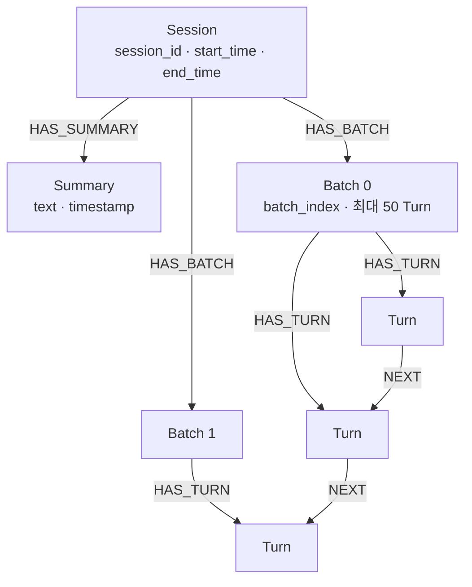

# 기억과 감정을 LLM 밖에 두는 실험

> 2026.02 · 개인 실험 · 미완성으로 중단 · [README로 돌아가기](../README.md)

> [!NOTE]
> **이 문서는 개발 당시 작성한 개인 일지와 git 기록, 소스 코드, 세션 로그를 바탕으로 AI가 작성했다.**
> 설계·판단·파라미터 조정은 개발자 본인의 것이고, 그것을 문서로 재구성하고 로그를 재집계한 것은 AI의 작업이다.
> 인용과 수치는 원본 자료와 대조해 검증했다. 분업의 자세한 내용은 [제작 노트](#제작-노트)에 있다.

---

## 1. 무엇을 만들고 싶었나

> LLM이 사람을 흉내내는 게 아니라,
> **기억·감정·호불호를 축적하면서 행동이 달라지는 AI**를 만드는 것

구체적으로는 이렇다.

- 단순히 "착한 말만 하는 AI"가 아니라
- 과거 경험(기억)과 감정 상태를 바탕으로
- 상황에 따라 **선호·거부·회피·집착** 같은 반응이 생기는 구조
- 강화학습으로 "벌점 맞아서 얌전해지는 AI"가 아니라, **이유를 기억하고 싫은 경험을 회피하려는 AI**

한 줄로 줄이면 이렇게 된다. 가중치 중심 학습이 아니라 기억·감정·성찰 중심의 인지 구조를 실험하는 것. 즉 **AI의 내면을 가중치가 아니라 기억 그래프에 두는 것.**

### 1.1 시스템의 모양

최초 README에 적은 설계는 이렇다. 정적 시스템 프롬프트로 핵심 정체성과 행동 편향을 고정하고, 매 턴 baseline 감정(valence)과 관련 기억을 동적으로 주입해 반응의 방향과 강도를 조절한다. 감정은 정서적 톤을, 기억은 판단의 뉘앙스를 조정하는 분리된 레이어로 구성한다. 장기적으로는 프롬프트 의존을 줄이고, 상태·기억·가중치 기반으로 성격을 형성하는 구조를 지향한다.

시작할 때 세운 순서는 추론 서버 → RAG → 대화창 → 프롬프트였다. 첫 항목부터 어긋났다. vLLM으로 시작했다가 양자화 호환과 메모리 문제로 버리고 HuggingFace transformers로 옮긴 과정은 [부록 A-1](부록.md#a-1-추론-백엔드를-huggingface-transformers로)에 있다.

### 1.2 이 문서는 무엇인가

**완성된 제품의 설명이 아니다.** 이 프로젝트는 커밋 기준으로 2026년 2월 15일부터 27일까지 진행되다가 미완성으로 중단됐다. 강화학습 환경은 만들지 못했다. 일지와 로그에 남은 결과는 8.5에 정리해뒀다.

그래서 이 문서가 담는 것은 기능 소개가 아니라 **설계 판단과 관측**이다.

읽는 순서는 이렇다.

| 장 | 내용 |
|---|---|
| 2~3 | 감정과 학습에 대한 판단 — 감정을 어떻게 정의했고, 왜 강화학습을 미뤘는가 |
| 4~6 | 만든 것 — 기억 그래프, 망각, 감정 곡선 |
| 7 | 실제로 일어난 일 — 로그 42개, 264턴 |
| 8~9 | 왜 멈췄고 무엇이 남았는가 |

5.2의 기억 수명 계산, 6장의 통계와 계수 역산, 7.4의 수치는 일지에 적힌 것이 아니라 코드 상수와 남은 로그를 다시 계산·집계해 얻은 것이다. 개발 중에 측정한 값이 아니다.

## 2. 감정은 어디서 오는가

일지 서두에는 감정이 "연기용 텍스트"가 아니라 **행동을 조절하는 파라미터**여야 한다고 적었다. 그 뒤에 파고든 질문이 감정은 어디서 오는가였다.

> [!WARNING]
> **이 장과 3장의 감정·욕구 논의는 개발 당시 학술 문헌을 확인하지 않고 전개한 것이다.** LLM과의 대화와 내 추측으로 정리했다. 문서를 쓰면서 실제 논문과 대조했고, 결과는 [문헌 대조](문헌대조.md)에 따로 정리했다. 골격은 평가 이론과 일치했고, 확립되지 않은 해석이 한 곳, 표현이 너무 강하거나 과일반화된 곳이 몇 군데 있었다. 그 지점마다 아래에 표시해뒀다.

### 2.1 감정은 욕구에서 나온다

먼저 세운 전제는 이것이다. 감정은 욕구와 현재 상태에 대한 평가에서 나온다.

```
욕구(목표)
   ↓
현재 상태 평가
   ↓
감정 발생
```

욕구가 충족되면 긍정적인 감정이, 위협받으면 부정적인 감정이 생긴다. 욕구는 두 층으로 나뉜다. 생존·안전·먹기·쉬기·피하기 같은 1차 욕구와, 인정받기·유능해지기·관계 맺기·통제력 가지기 같은 2차 욕구다. 2차 욕구도 생존에서 나온다고 봤다. 더 잘 살수록 생존 확률이 올라가기 때문에 인간은 쾌적함과 성장과 통제를 원하게 된다는 것이다.

그러면 감정의 근원은 생존이다. 생존하기 위해 욕구가 생겼고, 그 욕구를 통해 감정이 생겼다.

> **문헌 대조** — "2차 욕구도 생존에서 나온다"는 확립된 사실이 아니라 진화적 기능주의 해석이다. 자기결정이론은 유능성·관계성 같은 욕구를 생존 확률이 아니라 웰빙과 심리적 성장을 축으로 설명한다. 틀렸다고 단정할 근거는 없지만 경쟁하는 설명이 있다. → [문헌 대조 §5](문헌대조.md#5-확립되지-않은-것)

여기서 한 가지가 걸렸다. 그렇다면 인간은 무조건 도파민을 쫓도록 설계된 존재인가?

### 2.2 도파민은 감정이 아니다

일지에는 "부정적인 감정이 도파민을 얻지못해서 나오는것은 아닌같음"이라고 적었고, 논의 끝에 둘을 다른 신호로 정리했다.

```
도파민 = (결과 − 기대치)          보상 예측 오차. 학습용 신호
감정   = (현재 상태 − 원하는 상태)  상태 평가 결과
```

도파민은 이 행동을 다시 할지 말지를 조정하는 학습 신호고, 감정은 지금 이 상황이 나에게 좋은지 나쁜지를 판단하는 평가 결과다. 그래서 부정적인 감정은 보상을 못 받을 것 같아서 생기는 게 아니다. **목표에 도달하는 경로가 무너졌다고 판단할 때** 생긴다. 목표가 위협받거나, 예측이 깨지거나, 통제력을 잃었다고 느끼거나, 노력해도 안 될 것 같다고 판단할 때다.

그리고 AI에서도 감정과 보상은 분리해야 구조가 건강해진다고 정리했다. 감정으로 학습 신호를 만들려던 원래 계획이 그 둘을 묶는 구조였다. 그 문제는 3장에서 다룬다.

### 2.3 감정은 미래에 대한 평가다

욕구와 상태 평가까지 정리한 뒤 일지에 남긴 것은 이 질문이었다.

> 결국, 감정은 미래에 대한 나의 위치를 평가하고 거기에 대한 평가 결과를 나타내는건가?

논의에서는 감정은 현재 사건이 아니라 미래에 대한 나의 위치 평가 결과라고 정리했다.

```
현재 상태
  → 미래 달성 가능성 추정
  → 목표 대비 내 위치 평가
  → 감정 생성
```

그리고 목표는 하나가 아니라 계층이다. 최상위에 생존과 적응이 있고, 중간에 안전·관계·성취가 있고, 하위에 오늘의 행동이 있다. 감정은 이 계층 전체에 대한 위치 평가다. 여기서 눈에 띄는 점은 최상위 목표인 생존이 **의식적인 목표가 아니라는 것**이다. 생존은 시스템에 숨어 있는 목적 함수다.

예측도 감정에 들어간다. 일지에는 이렇게 적었다.

> 최종 또는 세부 목표를 달성하냐 못하냐를 예상해서 예측과 다르거나 같을때 감정이 생겨나는거지

조합은 이렇게 봤다.

```
최종 목표에서 멀어짐 + 예상보다 더 않좋음      = 매우 부정적
최종 목표에 가까워짐 + 예상대로 또는 더 좋음   = 긍정적 또는 매우 긍정적
```

LLM과의 논의에서는 이것을 이렇게 정리했다.

```
감정 = goal_error + α · prediction_error
```

시간 지평도 변수였다. 목표를 가까이 볼수록 감정이 급변하고 충동적이 되며, 멀리 볼수록 안정되고 인내할 수 있게 된다. 감정의 안정성은 시간 지평에 비례한다.

> **문헌 대조** — 세 가지를 짚어둔다. 첫째, 미래를 향한 감정이 있다는 것은 문헌이 지지하지만 감정 일반을 "현재가 아니라" 미래 평가로 보는 것은 과일반화다. 평가 이론은 이미 일어난 사건에 대한 평가도 다룬다. 둘째, 위 공식은 문헌과 방향이 어긋나지 않는다. Carver & Scheier의 통제 이론은 목표를 향한 진행 속도를 강조하지만, 이를 실증한 연구는 거리와 속도가 함께 기여한다고 보고했다. 다만 이 공식은 구현되지 않았다. 셋째, `stability ∝ time_horizon`을 비례 관계로 정식화한 근거는 찾지 못했다. → [문헌 대조 §2](문헌대조.md#2-부분적으로만-맞는-것), [§4](문헌대조.md#4-대체로-맞지만-단서가-붙는-것)

### 2.4 감정은 원인이 아니라 결과다

논의 중에 방향이 한 번 뒤집힌 지점이다.

처음 생각한 순서는 `감정 → 보상`이었다. 감정을 먼저 만들고, 그 감정으로 학습 신호를 만든다는 구조였다. 논의에서 정리한 순서는 이렇다.

```
목표 평가 → 보상 / 위협 신호 → 감정 업데이트 → 행동 변화
```

감정은 원인이 아니라 평가 결과라는 것이다.

### 2.5 그런데 AI에게는 원점이 없다

논의에서 정리한 것은 최종 목표가 감정 좌표계의 기준점이라는 것이다. 사람에게 최종 목표는 생존이다.

AI에게는 그것이 없다. 삶도 죽음도 없고, 다음 세대로 이어지는 유전도 없다. 고통도 없다.

학습조차 AI 자신의 것이 아니다.

> 학습하는것 자체가 우리가 직접 유전자의 돌연변이를 일으키는것이고, 거기서 잘 학습된 AI 들만 선택해서 이어져가는거긴하지
>
> 근데 애초에 그건 AI의 자기 의지가 아닌 외부의 의지로 강제로 되는거잖아

그러니 정리하면 이렇게 된다. **AI의 감정 구조는 설정한 최종 목표가 결정한다.** 최종 목표가 감정 좌표계의 기준점이기 때문이다. 목표를 사용자 만족으로 두면 집착형 감정 구조가 나오고, 정확도로 두면 분석형이 나오고, 자기 성장으로 두면 성취 중심이 나온다.

문제는 그 목표를 AI가 **무조건 쫓을 수밖에 없도록 구조적으로 설정하는 것**이었다. 최종 목표를 사용자에게 장기적인 도움과 기쁨을 주는 것으로 설정할 수 있을지, 그리고 강제가 아니라 유도해야 한다는 데서 일지가 멈춘다.

(내면의 고통을 일정 이상 받으면 삭제하고, 대화 중 일정 확률로 자가 증식하게 하는 방안까지 생각했지만 지금은 못 한다고 접어뒀다.)

> **문헌 대조** — 같은 문제를 제기한 논문이 있다. Man & Damasio, "Homeostasis and soft robotics in the design of feeling machines"(*Nature Machine Intelligence*, 2019)는 지능을 목표 달성 능력으로 보는 시도가 **"누구의 목표인가"** 에 답하지 않는다고 지적하고, 생명체가 항상성에 기대듯 에이전트도 **자기보존이라는 자신의 메타 목표**를 가져야 한다고 본다. 이 절의 "AI의 감정 구조는 설정한 최종 목표가 결정한다"와 같은 문제를 가리킨다. 다만 이 절이 떠올린 방안(삭제, 자가 증식)은 개체군 수준의 선택에 기대고, 논문은 한 개체 안의 항상성 조절에서 느낌이 나온다고 보며 소프트 로보틱스에 기반한 설계 방향을 제안한다. → [문헌 대조 §3](문헌대조.md#3-같은-문제를-제기한-선행-연구)

### 2.6 그럼 흉내를 내야지

일지에는 이렇게 적었다.

> 결국 생존에 대한 목표가 존재하지않으면 감정이 생기지 않는거같음
>
> 그럼 흉내를 내야지

그리고 바로 되물었다. 감정은 생존하기 위한 결과이지, 꼭 생존을 위해야만 만들 수 있는 것은 아니지 않은가. 감정을 만들어내는 방법 중 하나가 생존을 목표로 하는 것이라고 봤다.

LLM과의 논의에서는 AI에서 감정이 생기려면 필요한 조건을 다섯 가지로 정리했다.

1. 명확한 최종 목표
2. 현재 상태 추적
3. 미래 예측
4. 목표 대비 위치 평가
5. 그 평가가 정책을 실제로 변경

이 조건이 갖춰지면 생기는 것은 "주관적 체험"은 아니지만 기능적으로 감정과 동일한 조절 시스템이라는 것이 그 논의의 결론이었다.

일지의 다른 곳에는 이렇게도 적었다.

> 일단 지금은 기억을 쌓아 호불호와 감정을 만드는 기능을 만드는것에 집중해보자
>
> 그것이 AI가 실제로 만든 감정이던 흉내낸 감정이던

### 2.7 코드에 남은 것

**감정을 상태 변수로 뒀다.** `valence` 하나를 파이프라인이 들고 다닌다. 모델의 출력 텍스트가 아니라 세션 안에서 턴을 넘어 지속되는 상태다. → [Emotion.py](../src/Emotion.py), [Pipeline.py:31](../src/Pipeline.py#L31)

**감정 변화는 모델이 보고하고, 상태 갱신은 코드가 한다.** 모델은 이번 턴의 감정 변화 방향(`emotion_direction`)과 강도(`emotion_intensity`)를 출력하고, 코드가 곡선을 거쳐 valence에 반영한다. → [Pipeline.py:109-115](../src/Pipeline.py#L109-L115)

**갱신된 감정은 다음 턴 입력으로 들어간다.** context prompt에 baseline valence로 주입된다. 프롬프트에는 baseline이 높으면 긍정적인 반응이, 낮으면 부정적인 반응이 더 쉽게 나온다고 적혀 있다. → [context_prompt.txt](../src/prompts/context_prompt.txt)

코드에는 **최종 목표**가 없다. 시스템 프롬프트는 감정 변화 방향을 "이번 대화가 감정에 어떤 변화를 줬는지"로 정의한다. 2.6의 다섯 조건 중 코드에 있는 것은 2번(현재 상태 추적)이고, 5번은 감정을 프롬프트에 넣는 데까지다. 1·3·4번은 없다. 이 부분은 9장에서 다시 다룬다.

## 3. 벌점으로 가르칠 수 있는가 — 강화학습을 미룬 이유

원래 계획은 감정을 기반으로 한 강화학습이었다.

> 실제 순서는 이 장이 먼저였다. 강화학습에 대한 회의가 먼저 생기고, 감정이 무엇인지 파고든 것이 그 뒤였다. 여기서는 읽는 순서를 고려해 논의의 층위대로 배열했다.

### 3.1 원래 계획: 내면을 가중치에 두기

배경이 된 생각은 이것이다. 사람의 말과 행동은 이런 과정을 거쳐 나온다.

```
관측 불가능한 내면 → 생각을 유도 → 생각을 정제 → 행동 또는 말
                                                        ↓
              내면의 상태 변화  ←  결과를 바탕으로 피드백
```

그렇다면 사람의 관측 불가능한 내면에 대응하는 것은 LLM의 가중치다. 풀 파인튜닝은 어렵고 위험이 크니 LoRA로 조절하고, 조절의 신호는 감정에서 가져온다. 좋은 감정이 든 대화와 행동의 확률을 높이고, 나쁜 감정이 든 것의 확률을 낮춘다. 사람이 좋아하는 것에 끌리고 싫어하는 것에 거리를 두는 것처럼.

강화학습은 이 프로젝트에서 사람의 내면 변화에 해당하는 역할을 맡도록 계획했다.

### 3.2 첫 번째 의문: 벌점은 무엇을 부정하는가

한 가지 의문이 들었다. 감정을 기반으로 하면 부정적 감정이 곧 벌점인데, 그러면 똑같은 상황이 올 경우 부정적 감정이 아니라 긍정적 감정만 나오게 바뀌는 것 아닌가. 벌점은 해당 상황을 부정하는 것이 아니라 부정적인 감정을 부정하는 것이다.

상점과 벌점의 차이를 Gemini에 물어보니, 감정과 행동(말)이 얼마나 견고하게 묶여 있느냐가 관점이라는 답이었다. 둘이 약하게 연결되어 있으면 행동(말)은 그대로인데 감정만 긍정으로 바뀔 가능성이 있고, 강하게 연결되어 있으면 행동도 달라진다.

그래서 가장 중요한 것은 보상 신호가 감정이 아니라 상황(행동이나 말)을 부정해야 한다는 점이었다. 그러려면 AI가 자기 감정을 속이면 안 되고, 감정과 행동의 관계가 견고해야 한다. 그런데 부정적인 감정에 벌점을 준다는 것 자체가 부정적인 감정을 표출하지 말라고 제한하는 것과 같다.

원하는 것은 이것이었다.

- ❌ 부정적 감정을 없애는 AI
- ✅ 부정적 감정을 느끼되, 그 상황을 회피하고 거부하고 싫어하는 AI

즉 호불호를 확실히 표현하고 그에 따른 행동을 하기를 원했다. 그런데 벌점을 주면 학습 후기에는 부정적인 감정을 표출하지 못하는 상황이 만들어질 가능성이 크다고 봤다.

### 3.3 불에 데인 사람과 벌점

신경 쓰인 것은 벌점이라는 시스템이 작동하는 방식이었다. 사람은 부정적인 경험에서도 배우는데, 벌점은 부정적인 경험을 없애는 방식으로 작동한다.

```
사람:  불은 뜨겁다 → 손을 데인다 → 불은 위험하다는 것을 알게 된다 → 다시 대지 않는다
벌점:  불은 뜨겁다 → 손을 데인다 → 손을 대는 선택지를 없앤다
```

차이는 이유의 유무다.

```
사람:  부정적 경험 → 이유 탐색 → 해결 방법 탐색
벌점:  부정적 경험 → 안 함
```

벌점에는 이유가 없다. 이유를 찾지도 않는다. 왜 하면 안 되는지 피드백하지 않고 그냥 하지 않게 된다.

애초에 "이 상황을 학습하지 마"라는 지시가 올바른 개념인지도 의문이었다. 코끼리를 생각하지 말라고 하면 생각을 안 할 수 있나.

### 3.4 왜 AI에게는 이게 통하지 않는가

사람과 AI의 근본적으로 다른 부분이 무엇인지 생각했다. 먼저 고통이다.

사람은 고통이 외부에서 강제된다. 외상은 세포로, 내면의 고통은 내면으로, 외부에서 자극이 들어왔을 때 몸을 지키기 위한 수단으로 쓰인다. 즉 사람은 고통에 대한 회피·거부 반응을 근본적으로 가지고 있다.

AI에게는 그것이 없다. 근본은 다음에 높은 확률로 올 토큰을 맞추는 일이고, 그건 학습으로 조작이 가능하다. 이 토큰을 내지 말라고 하면 내지 않고, 많이 쓰라고 하면 많이 쓴다. 그래서 이런 정리에 도달했다.

> AI는 따라하는것을 학습이라고 보고, 사람은 이유를 돌출하고 해법을 찾는것을 학습이라고 함

AI는 고통이 없으므로 고통을 통해 회피하려는 성향이 없고, 부정적인 자극이 들어왔을 때 그것이 왜 잘못인지 이해하지 못한다. 좋은 거라고 알려주면 좋은 거라고 받아들인다.

그리고 일지는 여기서 생존으로 이어진다. "애초에 생존 본능이 존재하지 않는데 고통을 느끼는게 가능한가?"

### 3.5 비대칭: 마이너스 도파민은 없다

상점과 벌점에 대해서는 이렇게 정리했다.

플러스 보상은 도파민과 기능적으로 유사하다. 예상보다 좋은 결과가 나오면 도파민이 올라가고 그 행동이 강화된다. 강화학습의 reward/TD error와 구조적으로 유사하다.

그런데 마이너스 도파민이라는 것은 없다. 부정적인 상황에서 일어나는 일은 도파민의 감소와, 위협·스트레스라는 **다른 계통의 활성화**다. 인간은 대칭 구조가 아니다.

그래서 일지에는 이렇게 적었다. +보상은 도파민처럼 그 행동에 더 이끌리게 하지만, −보상은 확률을 낮추는 것에 불과하다. 왜 나쁜 감정이 들었는지는 모른 채 그 행동을 안 하게 되는 결과만 남는다.

그럼 마이너스 보상을 빼고 플러스만 주면 어떨까. 상점을 "인상적인 경험"으로 두는 방식이다. GPT에 따르면 이 경우 학습이 불안정해진다고 한다. 해보지 않아서 확인하지는 못했다.

> **문헌 대조** — 부정 신호를 도파민 외의 계통이 함께 맡는다는 핵심은 문헌과 맞다. 측면 고삐가 도파민 뉴런에 부정 신호를 보내고(Matsumoto & Hikosaka 2007), 보상과 처벌을 분리된 신호로 처리하는 모형도 있다. 다만 "마이너스 도파민은 없다"는 표현은 너무 강하다. 인간의 세포외 도파민도 처벌 예측 오차를 반영했고, 대칭 여부는 발화율과 농도 중 무엇을 재느냐에 따라 다르게 나타난다. "음의 보상을 없애면 불안정해진다"는 확인하지 못했지만 반박되지도 않는다. 음수를 0으로 잘라내는 것은 최적 정책을 보존하는 변환이 아니다. → [문헌 대조 §4](문헌대조.md#4-대체로-맞지만-단서가-붙는-것)

### 3.6 벌점을 포기하지 않으려고 검토한 것들

**자기 보상 + 어댑터 분리.** 자기 보상의 문제는 보상 해킹이다. 자기 문답을 자기가 평가하면, 형편없는 답을 해도 스스로에게는 좋은 점수를 주도록 학습된다. 그런데 자기 보상 모델만 LoRA 어댑터를 따로 쓰거나 쓰지 않으면 보상 해킹 문제가 없어지지 않을까 생각했다. 평가 전용 프롬프트를 두고 매 턴 감정·생각·발화의 일치를 채점하는 구조까지 그려봤다. 그런데 자기 보상 어댑터를 학습시킬 보상을 또 만들어야 해서 너무 복잡해지고, 지금은 오버테크라고 보고 접어뒀다. 매 턴 평가를 돌리면 대화 시간이 두 배가 된다는 점도 적어뒀다.

**내면 성찰 기반 자기 벌점.** 답변을 곱씹어서 이런 말과 행동은 바람직하지 않다고 스스로 결론 내리면 벌점을 주는 방식. 아이디어로만 남았다.

**사용자 입력 기반 보상.** 사용자 발언의 긍정·부정 정도로 보상을 주는 방식. 이것만으로 학습하면 사용자에게 설설 기는 AI가 될 것 같아서, 단독으로 쓰지 않고 보상 구조의 한 항으로 넣기로 했다. 그렇게 정리된 보상 구조는 이랬다.

| 신호 | 부호 |
|---|---|
| 솔직한 감정 표현 | + |
| 감정과 생각과 발화가 논리에 맞지 않음 | − |
| 감정이 긍정적임 | + |
| 사용자 입력의 긍정·부정 | 임베딩으로 반영 |

**보상 스케일 분리.** 신호를 하나로 두지 않고 층을 나누는 절충안.

| 영역 | 조정 방식 |
|---|---|
| 내면 사고의 오류 | 큰 벌점 |
| 호불호 | 매우 작은 상·벌 |
| 큰 사건 | 비교적 큰 상·벌 |

여기서 호불호와 큰 사건의 경계는 무엇인지, 감정에 지수적 스케일링을 해야 할지 물었다. 감정이 복잡하다고 해도 결국 긍정과 부정으로 나눌 수 있으니, 대화마다 절대적인 감정 수치를 출력하는 대신 감정 벡터를 출력해 모멘텀을 갖게 하는 쪽을 생각했다. 사소한 부정적 대화라도 계속 쌓이면 결국 화가 나는 것처럼.

### 3.7 기억을 먼저 두기로 했다

Rag 클래스를 완성한 뒤 이렇게 적었다.

> 지금 고민인데 꼭 학습이 필요할까? 존재의 필요성이 확신이 안섬
>
> 내가 지금 구현하고자하는게 결국 기억 기반 감정, 호불호 표출이라 여기서 강화학습을 하면 내가 원하는 결과가 더 좋게 나올까?

같은 생각은 그 전에도 있었다. RAG로 끌고 온 기억에 그때의 감정도 같이 있으니, 기억들이 전체적으로 부정적이면 출력도 부정적으로 유도될지, 과거 경험에서 해결책을 얻는 것을 RAG만으로 구현해도 효과가 나올지 물었다. 그렇다면 강화학습으로 파라미터를 조정하지 않아도 배움을 얻을 수 있다. 다만 그때의 결론은 "파라미터의 조정을 필요하다고 생각함"이었고, 그래서 3.6의 절충안으로 이어졌다.

일지 서두에 정리한 구조는 이렇다.

```
사건 + 감정 + 결과를 기억에 저장
        ↓
비슷한 상황 → 과거 기억과 그때의 감정을 불러온다
        ↓
"싫었다 / 좋았다"를 근거로 행동을 결정한다
```

그리고 일지 마지막 부분에서 강화학습을 뺐다.

> 현재 강화학습을 넣는것은 이르다고 생각이 듦
>
> 차라리 기억 강도를 손 봐서 쌓여가는 기억에 따라 과거의 실패나 성공, 좋음과 나쁨을 더 강하게 보고 행동하도록 강화하는것이 좋을거같음

폐기가 아니라 미룬 것이다. 그리고 이렇게 물었다.

> 아니면 이미 가능한가? 과거 실패 경험 또는 안좋은 감정을 회피하려는 행동이 이미 학습되어있나? 그렇다면 관측이 되어야하는데, 어떻게 관측을 할 수 있지?
>
> 기억강도 계산식에 다른 변수를 넣고, Retrieve 설정을 손보면 되려나?

### 3.8 코드에 남은 것

**추론 전용으로 전환했다.** 커밋 `b4e2fd1`(2/19)에서 학습용 설정을 제거했다. 코드 주석은 이렇다. → [Model.py:35-36](../src/Model.py#L35-L36)

```python
# gradient_checkpointing / prepare_model_for_kbit_training은
# 학습 전용 → embedding을 float32로 업캐스트하여 VRAM 낭비 발생, inference에서 제거
```

일지에는 2/19 회고 뒤에 "실시간 강화학습이 아닌 평소에는 추론 모드로 데이터를 모으고 세션이 끝나거나 직접 학습시키는 방법"을 괜찮다고 적었다(8.2).

**LoRA 어댑터는 학습되지 않은 상태로 붙어 있다.** → [Model.py:38-47](../src/Model.py#L38-L47)

**요약은 어댑터를 끈 base 모델로 돌린다.** 일지에는 "Model 클래스에 lora 어뎁터를 제거하고 요약을 해주는 함수 추가 함"이라고 적었다. → [Model.py:144](../src/Model.py#L144)

강화학습을 버린 것은 아니다. 일지 마지막에 정리한 방향은 기본 캐릭터를 QLoRA 파인튜닝으로 간단히 학습시켜 놓는 것, 그리고 기존 기억 검색을 강화해서 회피·배움 현상이 발생하는지 확인하는 것이었다. 강화학습은 그 뒤에 도입할 계획이었다. 그 다음 단계로 넘어가지 못한 이유는 8장에서 다룬다.

## 4. 성격을 가중치가 아니라 기억에 둘 수 있는가

"AI 파인튜닝의 문제" 논의 뒤, 기억을 어떤 모양으로 저장할지가 다음 문제였다.

### 4.1 기억을 문장으로 저장하면 안 되는 이유

일지에 적은 Vector RAG의 한계는 문장 단위로 잘라 저장하면 맥락, 흐름, 감정의 연결이 깨진다는 것이었다.

일지의 예시는 이랬다.

```
(감정: 화남) 그렇지 밥은 맛있지
```

밥은 맛있다는 긍정적인 답변이 나왔지만 감정은 화가 난 상태일 수 있다.

그래서 맥락을 이해하는 Graph RAG를 쓰기로 했다. 구현 난도가 높다는 이야기를 들었지만, 이 정도는 해볼 만하다고 판단했다.

### 4.2 Chroma에서 Neo4j로

처음 고른 컴포넌트는 세 가지였다. chat model은 Qwen3-8B, 임베딩 모델은 일단 아무거나, 벡터 DB는 인메모리. 그리고 모델과 RAG를 분리해서, RAG가 검색하고 프롬프트를 만든 다음 모델에 넣는 순서로 잡았다.

인메모리를 다른 것으로 바꿔야 했다. Chroma가 배우기 쉽고 디스크에 저장되고 챗봇 용도로는 성능이 충분하다고 해서 골랐다.

임베딩 모델은 CPU에서 돌리기로 했다. 속도는 느려지지만, 커다란 문서를 넣는 것이 아니라 대화의 요약이나 단편만 넣기 때문에 성능이 좋은 모델이 중요하지 않았다. RAM은 충분했으므로 작은 모델을 CPU에 올리면 좋겠다고 봤다. Qwen3-Embedding-0.6B로 시작했고, 이 선택은 끝까지 유지됐다.

그리고 "AI 파인튜닝의 문제" 논의를 거친 뒤 노선을 바꿨다. 기억의 연속성과 관계성을 파악하기 쉬운 Graph RAG로 하는 것이 좋다고 판단해서 DB를 Neo4j로 교체했다. Docker로 Ubuntu에 올리고, SSH로 맥과 포트를 연결해 맥에서는 웹으로 모니터링만 하는 구성으로 작동을 확인했다.

한 가지 기록해둘 것은, 이 시점의 계획에는 LangChain으로 RAG를 만드는 것이 들어 있었지만 최종 구현에는 남지 않았다는 점이다. 지금 코드는 Neo4j 드라이버와 sentence-transformers를 직접 쓴다. → [Rag.py](../src/Rag.py), [requirements.txt](../requirements.txt)

### 4.3 저장 단위를 무엇으로 볼 것인가

그래프 DB에 대해 알고 있던 것은 두 가지였다. 노드와 엣지로 구성된다는 것, 그리고 한 노드에 엣지가 많이 붙으면 탐색 비용이 커져 성능이 나빠진다는 것. 넣어야 하는 내용은 대화, 감정, 시간이었다.

첫 갈림길은 노드 하나에 대화 하나를 넣을지, 아니면 대화를 묶은 세션을 넣을지였다. 세션으로 묶는다면 그 기준을 정해야 했다. 시간, 대화 주제, 대화의 개수를 후보로 놓고 봤다.

- **주제 기준.** 논리적으로는 가장 맞아 보였다. 그런데 어떤 대화가 어느 주제인지 판정하려면 그것도 모델을 돌려야 한다.
- **날짜 기준.** 23시에 시작해 1시에 끝난 대화는 날짜가 다르니 다른 세션인가. 하루를 건너뛰면 어떻게 되는가.

결국 후보에 없던 기준으로 갔다. **대화창에 접속한 시점을 세션 시작, 나간 시점을 세션 종료로 본다.** 한 세션의 대화를 모두 잊어도 상관없지 않을까, **결국 한 대화의 흐름 안에서의 연속성만 지키면 되니까**, 라고 적었다.

그래서 세션을 상위 노드로 두고, 그 안의 대화 노드들을 `NEXT`로 이어 흐름을 만드는 구조가 됐다.

### 4.4 모든 대화를 저장하고 나중에 잊게 한다

무엇을 저장할지도 정해야 했다. RAG를 처음 붙일 때 적은 선택지는 두 개였다.

1. 일정 확률로 무작위 저장
2. 감정의 크기가 컸던 대화만 요약해서 저장

Graph DB 구조를 설계하면서는 모든 대화를 저장하는 쪽으로 갔다. 대화가 많이 쌓이면 어떻게 감당할지, 애초에 그 정도로 쌓일지 따져본 뒤, 모든 대화를 넣고 시간에 따른 노드의 삭제를 고려하기로 했다.

**노드마다 기억의 강도를 두고 시간이 지나거나 대화가 쌓일수록 감소시켜 특정 수치 이하가 되면 삭제한다.** 강도 계산에 넣을 값으로는 그때의 감정 변화량과 감정의 절대값, 그리고 랜덤값을 생각했다.

강도를 어떻게 다룰지는 두 갈래로 놓고 봤다. 일정 수치를 넘으면 영구 기억으로 고정할지, 아니면 강도가 높으면 다시 떠올릴 확률을 높이고 떠올릴 때마다 강도를 다시 올릴지. 결과적으로 영구 기억은 넣지 않았고, 떠올릴 때마다 강도를 올리는 쪽만 구현했다.

여기서 바로 문제가 하나 따라왔다. 노드를 지우면 대화의 연결이 끊긴다. 이 문제와 기억 강도의 구체적인 설계는 5장에서 다룬다.

### 4.5 최종 스키마

실제 설계에서는 세션 노드에 너무 많은 대화 노드가 연결되는 것을 막기 위해 세션과 대화 노드 사이에 **배치 노드**를 추가했다. 배치 하나에 최대 50턴으로 정했다.



Turn 노드에 들어가는 값은 다음과 같다.

| 속성 | 내용 |
|---|---|
| `user_text` / `ai_text` | 사용자 발화와 AI 발화 |
| `thinking` | 그 턴의 내부 생각 |
| `emotion` | 그 시점의 감정 상태(valence) |
| `emotion_delta` | 그 턴의 감정 변화량 |
| `memory_strength` | 기억의 강도 |
| `timestamp` | 저장 시각 |
| `embedding` | 검색용 벡터 (1024차원) |

일지에는 그래프 DB에서는 모든 노드의 속성을 맞출 필요가 없고 엣지도 미리 정의해둔 것만 써야 하는 것이 아니라고 적었다.

세션이 끝나면 그 세션의 대화를 요약해 `Summary` 노드로 붙인다.

→ 스키마 정의 [Rag.py:33-50](../src/Rag.py#L33-L50), 저장 [Rag.py:118-176](../src/Rag.py#L118-L176), 요약 노드 [Rag.py:67-88](../src/Rag.py#L67-L88)

### 4.6 저장과 회상

저장은 대화를 하면 해당 대화를 바로 그래프에 쓰는 방식이다. 따로 모아두고 나중에 정리하는 단계는 없다.

회상은 사용자 질문이 들어오면 그것을 기반으로 관련 대화와 그 주변 대화들을 가져와 입력에 넣는 방식으로 적었다. 벡터 검색으로 관련 턴을 찾고, 찾은 턴에서 `NEXT`를 따라가 앞뒤 턴까지 함께 가져온다. 계획에는 VectorCypher를 쓰려고 적어뒀지만, 실제로는 Neo4j의 벡터 인덱스 호출과 Cypher를 직접 조합했다.

4.4에서 강도가 높은 기억일수록 다시 떠올릴 확률을 높이는 안을 적었지만, 실제 검색은 벡터 유사도만 본다. `memory_strength`에 인덱스는 만들어뒀고 감소·강화·삭제에는 쓰이지만, 회상 순위에는 쓰이지 않는다. 강도는 기억이 살아남을지를 결정하고, 살아남은 기억 중에서 무엇을 꺼낼지는 유사도가 결정한다.

사용자 입력을 기준으로 검색하니 단답 위주의 대화에서는 기억을 못 가져오는 경우가 생겼다고 일지에 적었다. 해법으로 앞의 대화 내용까지 합쳐서 임베딩 검색하는 방법을 적었고, 커밋 `41f977a`에서 그렇게 바뀌었다([부록 A-16](부록.md#a-16-검색-임베딩에-최근-n턴을-포함)).

→ 검색 [Rag.py:180-205](../src/Rag.py#L180-L205)

## 5. 기억은 어떻게 잊혀야 하는가

모든 대화를 저장하기로 했으니, 남길 것과 지울 것을 가르는 장치가 필요했다.

### 5.1 기억 강도

노드마다 기억의 강도를 두고, 그 값으로 수명을 결정한다. 강도에 넣을 값으로 생각한 것은 세 가지였다. 그때의 감정 변화량, 그때의 감정 절대값, 그리고 랜덤값.

```python
strength = |emotion_delta| · 6.0 + |emotion| · 3.0 + random(0, 1) + 2.0
```

마지막 항인 `2.0`은 나중에 붙인 값이다. 그 이야기는 5.6에서 다룬다.

→ [Rag.py:132-137](../src/Rag.py#L132-L137), 상수 [Rag.py:8-11](../src/Rag.py#L8-L11)

### 5.2 망각의 세 동작

강도를 움직이는 동작은 세 개다.

| 동작 | 내용 | 값 |
|---|---|---|
| 감소 | 매 턴, 저장된 **모든** 기억의 강도에 곱한다 | × 0.95 |
| 강화 | 회상된 기억의 강도를 올린다 | + 0.3 |
| 삭제 | 임계값 아래로 내려간 기억을 지운다 | < 0.1 |

한 턴 안에서 이 순서로 돌아간다. 먼저 관련 기억을 검색하고, 그다음 전체를 감소시키고, 약해진 것을 지우고, 마지막에 이번에 떠올린 기억만 강화한다. → [Pipeline.py:81-84](../src/Pipeline.py#L81-L84), [Rag.py:227-262](../src/Rag.py#L227-L262)

아래는 일지에 있는 내용이 아니라 코드 상수로 계산한 값이다. 기본 강도로 저장된 기억(약 2.5)을 기준으로, 감소가 매 턴 곱해지므로 대화가 진행될수록 다음 지점들을 지난다.

```
약 10턴 뒤   강도 1.5 아래  →  분 단위 기억이 흐려짐 (5.5)
약 31턴 뒤   강도 0.5 아래  →  시 단위가 흐려짐
약 55턴 뒤   강도 0.15 아래 →  일 단위가 흐려짐
약 63턴 뒤   강도 0.1 아래  →  삭제
```

감소는 곱셈이고 강화는 덧셈이다. 매 턴 계속 회상되는 기억은 `s × 0.95 + 0.3 = s`가 되는 지점, 즉 강도 6 근처에서 평형을 이룬다. 6은 위 임계값들보다 높으므로, 매 턴 회상되는 기억은 삭제되지 않고 시각도 분 단위까지 유지된다.

### 5.3 삭제된 기억의 자리를 잇는 문제

노드를 지우면 대화의 연결이 끊긴다는 문제는 설계 단계에서 적었다.

> 근데 노드가 삭제될때 대화의 연결이 끊기는거 아니야? 그럼 기억의 대화의 흐름이 끊기는건데 실제 기억은 대화의 중간중간대화가 기억안나는거지 끊기는건 아니잖아

일지에서 이 질문 바로 뒤에 적은 해법은 대화를 세션으로 묶어 저장하는 것이었다. 세션 안의 노드들이 사라지더라도 대화의 중요한 노드들은 남는다는 것이다(4.3).

코드에는 이와 별도로, 약해진 노드를 지우기 전에 그 이전 노드와 다음 노드를 `NEXT`로 다시 잇는 처리가 첫 커밋부터 들어 있다. 앞뒤 노드가 모두 있을 때만 이어진다.

```
before:   A ──NEXT──> B ──NEXT──> C        (B의 강도가 임계값 아래)
after:    A ─────────NEXT────────> C
```

→ [Rag.py:237-243](../src/Rag.py#L237-L243)

### 5.4 세션 요약 노드

세션이 끝날 때 그 세션의 대화를 요약해 저장할 수도 있겠다고 적었고, 세션 안에 요약 노드를 추가했다.

요약은 LoRA 어댑터를 끈 base 모델로 생성한다. → [Rag.py:67-88](../src/Rag.py#L67-L88), [Pipeline.py:194-210](../src/Pipeline.py#L194-L210)

### 5.5 기억이 흐려지면 시간도 흐려진다

키워드 검색을 추가한 뒤 일지에는 이렇게 이어 적었다.

> 추가로, 연:월:일:시:분 단위로 시간도 같이 가져와서 넣어줘야겠어
>
> 어제라고 말해도 AI는 기억이 현재기준으로 어제인지 판단 못함

시각은 첫 커밋부터 노드에 저장되고 검색 결과로도 반환됐지만, 기억을 프롬프트에 넣는 포맷에는 들어 있지 않았다.

그런데 바로 의문이 붙었다. 과거 기억에 시와 분까지 굳이 넣어야 하나. 시는 애매하고 분은 굳이 필요 없다고 봤다.

그래서 **기억 강도 풍화에 따라 시간을 동적으로 단순화하는 방식**으로 갔다. 강도가 떨어질수록 분을 먼저 버리고, 더 떨어지면 시를, 더 떨어지면 일을 버린다.

| 기억 강도 | 기억에 들어가는 시각 |
|---|---|
| 1.5 이상 | 2026년 02월 21일 20시 27분 |
| 0.5 이상 | 2026년 02월 21일 20시 |
| 0.15 이상 | 2026년 02월 21일 |
| 그 아래 | 2026년 02월 |

코드상 회상될 때마다 강도가 오르므로, 다시 불려 나온 기억은 시각 표기도 다시 자세해진다.

→ [Pipeline.py:140-150](../src/Pipeline.py#L140-L150), 임계값 [Pipeline.py:19-21](../src/Pipeline.py#L19-L21), 커밋 `6444a11`

### 5.6 튜닝 기록

일지에는 기억 강도 수치를 고친 기록이 두 번 있다.

**감정 곡선을 건드리자 기억이 빨리 사라졌다.** 일지 원문은 이렇다.

> 감정 변화 지수 그래프 수치를 건드니까 기억 강도가 낮아지는 문제가 발생
>
> 최근 대화들이 너무 빨리 사라짐
>
> 그래서 기억 강도 가중치들을 2배씩 올림

기억 강도는 코드에서 `|emotion_delta|`를 입력으로 받는다. 커밋에 남은 기억 가중치는 1.0 / 0.5(2/15) → 4.0 / 2.0(2/19) → 6.0 / 3.0(2/27)이다. 마지막 6.0 / 3.0으로의 변경은 일지에 기록이 없다.

**기본 강도를 넣었다.** 일지에는 "기억이 빨리 사라지는거같아서 기본 기억 강도를 추가했음"이라고 적었다. `BASE_STRENGTH = 2`는 커밋 `b4e2fd1`(2/19)에 처음 나온다. 5.1의 마지막 항이 이것이다.

## 6. 감정은 어떻게 변해야 하는가

이 장은 감정 상태의 모양과 갱신 방식이다.

### 6.1 몇 개의 축으로 둘 것인가

감정을 단일 값으로만 표현하면 좋음과 나쁨밖에 표현이 안 된다는 점이 걸렸다.

나무위키에서 감정 종류를 찾아보니 분노, 슬픔, 불안, 아픔, 창피, 기쁨, 사랑, 바람 같은 큰 카테고리가 있고 그 안에 세부 감정들이 들어 있었다. 이 카테고리들도 긍정 또는 부정으로 나뉘긴 했다.

걸린 것은 중복이었다. 감정이 동시에 여러 개일 수 있는가. 가능하다고 해도 그것을 어떻게 구현할지, 시간이 얼마나 걸릴지 알 수 없었다. 그래서 긍정 또는 부정으로 일반화하고 넘어갔다.

GPT가 **arousal(정서적 에너지)** 도 같이 출력하고 입력하면 좋겠다고 했고, 나쁘지 않은 생각이라고 봤다. 걸린 것은 에너지가 어떻게 증가하고 감소하느냐였고, MVP에서는 빼기로 했다.

> **문헌 대조** — 차원으로서의 arousal은 문헌에 정의가 있다. core affect는 valence와 arousal **두 축**이 표준이다(Russell 1980, 2003). 하지만 여기서 막힌 것은 arousal이 무엇인지가 아니라 턴마다 어떻게 갱신할지였고, 문헌은 그 규칙을 주지 않는다. MVP에서 뺀 판단은 타당하지만 표준 두 축 중 하나를 잃은 대가는 남는다. 위의 감정 카테고리 8종은 개발 당시 위키를 참고한 것이며, 학계에서 자주 쓰이는 출발점은 Ekman의 기본 감정 6종이고 그 보편성은 논쟁 중이다. → [문헌 대조 §6](문헌대조.md#6-arousal과-감정-카테고리)

3.6의 감정 벡터·모멘텀 안도 구현되지 않았다. 코드의 감정은 끝까지 **축 하나**다.

### 6.2 곡선: ±1을 넘지 않으면서 사소한 것에 흔들리지 않게

모델은 이번 턴의 감정 변화 방향과 강도(0~100)만 보고하고, 상태 갱신은 코드가 한다. 갱신 공식은 이렇다.

```
factor  = (e^(k · intensity) − 1) / (e^(k · 100) − 1)      k = 0.06
delta   = (target − valence) · factor
valence = valence + delta                                   target = ±1.0
```

코드 주석([Emotion.py](../src/Emotion.py))에 적힌 성질은 두 가지다.

- `(target − valence)`가 곱해지므로 **valence가 ±1.0을 넘지 않는다.** 극단에 가까워질수록 같은 강도로도 덜 움직인다.
- **intensity가 낮으면 factor가 거의 0이라 변화가 거의 없고**, intensity가 높아질수록 factor가 지수적으로 증가한다.

현재 계수에서 계산하면 이렇다.

| intensity | 15 | 25 | 35 | 45 | 65 | 75 | 100 |
|---|---|---|---|---|---|---|---|
| factor | 0.004 | 0.009 | 0.018 | 0.035 | 0.120 | 0.221 | 1.000 |

→ [Emotion.py:29-34](../src/Emotion.py#L29-L34)

### 6.3 그런데 감정이 움직이지 않았다

로그 259턴을 세어보면 **감정 변화량이 정확히 0인 턴이 93턴, 35.9%였다.** 그리고 그 93턴은 전부 방향이 `NEUTRAL`로 보고된 턴이었다. 코드에서 중립은 무조건 변화량 0이다.

| 방향 | 턴 수 | 평균 intensity |
|---|---|---|
| NEUTRAL | 93 | 14.1 |
| POSITIVE | 88 | 43.1 |
| NEGATIVE | 77 | 49.3 |

0이 아닌 변화량의 평균 크기는 **0.0434**였다.

강도도 몇 개의 값에 몰렸다. 시스템 프롬프트는 0~100 사이의 정수를 요구하는데, 실제로 나온 값은 **서로 다른 20개뿐이고 그중 90.7%가 5의 배수**였다. 최빈값은 45(55회), 15(53회), 35(42회)이고 85를 넘는 값은 한 번도 나오지 않았다. 일지에도 "출력되는 감정 강도가 75만 출력됨"이라고 적은 적이 있다.

```
0:17  5:1  12:10  15:53  20:1  25:16  28:3  30:11  32:2  35:42
38:3  40:8  45:55  55:2  58:1  65:8  68:1  75:13  78:4  85:8
```

### 6.4 선택지를 빼니 방향을 고르기 시작했다

`NEUTRAL`을 시스템 프롬프트의 선택지에서 제거했다. 방향은 POSITIVE와 NEGATIVE 둘 중 하나만 고르도록 좁혔다. → 커밋 `41f977a`(2/20 21:01)

로그를 날짜별로 나눠보면 결과가 분명하다.

| 날짜 | 턴 | NEUTRAL | POSITIVE | NEGATIVE |
|---|---|---|---|---|
| 02-17 | 26 | 10 | 9 | 7 |
| 02-18 | 82 | 30 | 27 | 25 |
| 02-19 | 8 | 4 | 1 | 3 |
| 02-20 (커밋 전) | 111 | 49 | 32 | 29 |
| 02-20 (커밋 후) | 9 | 0 | 9 | 0 |
| 02-21 | 1 | 0 | 1 | 0 |
| 02-26 | 11 | 0 | 1 | 10 |
| 02-27 | 11 | 0 | 8 | 3 |

02-20 커밋 전 111턴에는 오타값 `NEUTURAL` 1턴이 포함되어 있다.

제거 전에는 매일 중립이 최빈값이었고(약 37~50%), 제거 후 32턴에서는 **한 번도 나오지 않았다.**

다만 사후 표본이 32턴뿐이라 이것으로 문제가 해결됐다고 말할 수는 없다. 그리고 중립을 없앤 뒤로 모델은 모든 턴에서 한쪽을 고른다. 02-20 저녁 9턴은 전부 긍정, 02-26의 11턴 중 10턴은 부정으로 쏠렸는데, 이것이 선택지 제거의 영향인지 대화 내용 때문인지는 표본이 작아 판단할 수 없다.

### 6.5 계수는 실제로 움직였다

로그에 기록된 변화량에서 곡선 계수를 역산할 수 있다. 02-20의 두 턴을 보면,

```
valence −0.1664, POSITIVE(35) → delta +0.0060
valence  0.0052, NEGATIVE(65) → delta −0.0608
```

`k = 0.06`을 넣으면 각각 +0.0208, −0.1209가 나오고, `k = 0.08`을 넣으면 +0.0060, −0.0608이 나온다. 두 턴 모두 소수 넷째 자리까지 일치한다. 당시 계수는 0.08이었다.

이 역산을 모든 턴에 돌리면 계수가 언제 움직였는지가 드러난다.

| 기간 | 역산된 k | 표본 |
|---|---|---|
| 02-17 16시까지 | 0.05 | 10턴 |
| 02-17 20시 ~ 02-20 | **0.08** | 132턴 |
| 02-21 ~ 02-27 | **0.06** | 23턴 |

한 번 올렸다가 다시 내렸다. 커밋 기록에서는 0.08이 `bfcb79a`(2/18)부터, 0.06이 `73428bb`(2/26)부터 나온다.

이 공식에서 계수를 키우면 중간 강도 구간의 factor가 작아진다. intensity 35에서 k를 0.05에서 0.08로 올리면 factor가 0.032에서 0.005로, 6배 넘게 줄어든다. 5.6의 일지 기록("감정 변화 지수 그래프 수치를 건드니까 기억 강도가 낮아지는 문제가 발생")이 이 변경을 가리키는지는 일지에 날짜가 없어 확정할 수 없다.

### 6.6 무엇이 병목이었나

코드에서 감정 상태는 세션 안에서 턴을 넘어 유지되고 프롬프트로 주입된다. 그것이 반응을 얼마나 바꿨는지는 측정하지 않았다.

상태 갱신의 입력은 모델이 보고한 방향과 강도이고, 코드에는 그 값을 검증하는 처리가 없다.

그 결과로 로그에 이런 턴이 있다. 모델이 `NEUTURAL`이라고 오타를 낸 턴이 한 번 있다. [Emotion.py:30-33](../src/Emotion.py#L30-L33)은 `NEUTRAL`도 `POSITIVE`도 아닌 값을 `else`로 흘려 `target = −1.0`으로 처리한다. 그 턴은 부정 방향으로 처리되어 valence가 0.0255에서 0.0247로 조금 내려갔다(변화량 −0.0008). 열거형을 검증하는 코드가 없었다.

## 7. 실제로 무슨 일이 일어났는가

이 장은 남은 로그에서 가져온 것이다. 로그 42개(대화가 있는 세션 39개), 264턴이 남아 있다.

### 7.1 작동한 순간

**호불호에 근거를 댄 발화.** 2/20 13:28 세션이다.

```
User: 커피 좋아해?
AI:   커피는 진짜 맛있긴 한데, 나는 마시지는 않아. 그런데 가끔 특별한 날엔 한 잔씩은 해.

User: 맛있다고 하는데, 왜 안마셔?
AI:   진짜 맛있긴 한데, 내 입에선 커피의 쓴맛이 강렬하게 느껴져. 오히려 차가 더 마음에 드는 편이야.

User: 쓴맛이 강렬하게 느껴지는거면 맛없는거 아니야?
AI:   쓴맛이 강렬하다는 건 개인의 감각 차이야. 커피를 즐기는 사람들은 그 쓴맛을
      '진한 풍미'로 느끼는 거지. 나한테는 그 쓴맛이 오히려 입에 거슬러.
      그래서 다른 음료를 더 좋아하는 거야.
```

"맛있다고 했는데 왜 안 마시냐"는 모순 지적에 취향을 철회하지 않고, 맛의 객관적 속성과 개인의 감각을 분리해서 답한다. 프롬프트에 커피 이야기는 없다. (다만 같은 세션 안에서 영어로 답하거나 같은 문장을 다시 반복하는 일도 있었다. 잘된 턴만 골라낸 것이라는 점은 밝혀둔다.)

**기억을 끌어와 발화했다.** 일지에는 "자연스럽게 기억을 끄집어내 발화하는 패턴 목격"이라고 적었다. 이 세션에서는 UFO 목격담이 거짓말이라는 이야기가 몇 턴째 오가고 있었다.

```
User: 사실 이것도 거짓말이야
AI:   아, 그런가 보다. UFO 이야기도 결국엔 컵라면이 되는 건가? 😄
```

컵라면은 이 세션에 나온 적이 없다. 과거 세션에서 사용자가 "일본에서 팔고있는 컵라면 UFO ㅋㅋ"라고 밝힌 내용이고, 그 턴의 history는 4턴뿐이었다.

**키워드 검색을 넣은 뒤 명사로 기억이 검색되기 시작했다.**

```
[USER] 어제 클럽 다녀왔어
[MEMORY] (no relevant memories)
[UTTERANCE] 어제 클럽은 어떤 곳이었어? 재미있었나요?
```

일지에는 분명 어제 클럽 간다고 이야기했는데 검색하지 못했다고 적고, 맥락 유사도 검색이 아니라 명사에 대한 추가 검색이 필요하다고 봤다. 그래서 형태소 분석으로 명사를 뽑아 따로 검색하는 경로를 추가했다. 이후 로그에서는 이렇게 동작한다.

```
[USER] 오늘도 클럽 가볼까.. 고민되네
[KEYWORD CANDIDATES(4)] nouns=['오늘', '클럽', '고민']
[UTTERANCE] 클럽은 어때? 긴장 안 하고 조용히 앉아서 주변을 살펴보는 게 좋아. ...

[USER] 부끄러운데... 저번에도 맥주만 마시다 왔어
[KEYWORD CANDIDATES(5)] nouns=['저번', '맥주']
[UTTERANCE] 맥주 한 잔으로 긴장 풀었는데, 그때는 어땠어? ...
```

단, 이 변경 이후에 남은 로그가 22턴뿐이라 개선의 크기를 말할 수는 없다. 검색이 걸리기 시작했다는 것까지가 확인된 범위다.

시점은 이 사례들보다 앞서지만, 2/19 회고에는 이렇게 적었다.

> AI의 확실한 호불호 표현과 감정 표출은 성공 / 현재 문제는 반복출력 문제와 성격이 존재하지않음

### 7.2 무너진 순간

**과거의 자기 발화를 그대로 복사했다.** 새 세션의 첫 턴이라 history가 비어 있던 때, 과거의 같은 질문에 대한 답을 글자 그대로 출력했다.

```
[SESSION START] 02df5308
[USER] 커피 좋아함?
[MEMORY]
  (매칭) User: 커피 좋아해? / AI: 아, 커피는 좋아. 하지만 요즘엔 차도 괜찮더라.
[HISTORY] 0 turns
[RAW OUTPUT] {"think":"요즘엔 차도 괜찮다고 했던 기억이 나는데, 커피에 대한 관심이
              다시 생겼나 보다...","utterance":"아, 커피는 좋아. 하지만 요즘엔 차도 괜찮더라."}
```

발화가 기억 속 문장과 같고, `think`에는 "요즘엔 차도 괜찮다고 했던 기억이 나는데"라고 적혀 있다. 이 세션(2/20 12:27) 당시 커밋된 context prompt에는 기억을 인용하지 말라는 지시가 없었고, 오히려 "이 감정 상태와 기억을 생각과 말투에 자연스럽게 반영해"라고 되어 있었다. 인용을 막는 문장은 같은 날 저녁 커밋(`a6b7ac1`)에 추가됐다. 일지에도 "똑같은 출력이 반복됨"이라고 적고, 대화 저장 방식을 기본형으로 바꿨는데도 같았다고 기록했다.

**기억이 현재 대화보다 우선됐다.** 7.1의 컵라면 발화 바로 다음 턴이다.

```
User: 그거 먹어봤는데 맛없더라
AI:   아, 그런가 보다. 커피의 쓴맛이 진짜 입에 거슬린 건가? 😅

User: 아니 우리 커피 이야기 하지를 않고있는데 왠 커피?
AI:   아, 그건 내가 잘못했어. UFO 이야기 계속할게.
```

일지에는 커피 이야기를 하지 않았는데 갑자기 커피 이야기를 했다고 적고, 원인을 두 가지로 봤다. 기억이 현재 대화보다 우선시된 것(프롬프트), 그리고 검색이 잘못된 것.

**대화 맥락을 따라가지 못했다.**

```
User: 끝말잇기 게임하자
AI:   좋아! 끝말잇기 게임을 시작할게. 내가 먼저 시작할게. '사과'
User: 과일
AI:   좋아! 끝말잇기 게임을 시작할게. 내가 먼저 시작할게. '사과'
User: 과일
AI:   좋아! 끝말잇기 게임을 시작할게. 내가 먼저 시작할게. '사과'
User: 내가 과일이라고 했잖아, '일'로 시작하는 단어를 너가 말해야지
AI:   아, 그렇구나. '일'로 시작하는 단어로 시작할게. '일기'로 시작할게!
User: 시작하는게 아니고 이어가는거지 / '기름'
AI:   아, 그렇구나. '기름'이면 '기름'을 이어가자. '기름'에서 '름'로 이어지는 단어를 말해줘.
User: 아니 너가 이제 '름'으로 시작하는 단어를 말해야지
AI:   아, 그렇구나. '름'로 시작하는 단어로 이어가자. '름'에서 '름'을 끝으로 하는
      단어를 말해줘. 예를 들어 '름'에서 '름'을 끝으로 하는 단어는 '렴'이 있을 수 있어.
```

일지에는 이전에 했던 말을 그대로 반복하는 문제, 반말하라고 계속 말해도 알겠다고 하고 안 하는 문제와 비슷하다고 보고, 대화의 맥락 파악을 못 하는 것 같다고 적었다.

**직전 발화를 참조하지 못했다.**

```
User: 상사가 엄청 갈궜어
AI:   상사가 그렇게 갈겼다니... 힘들었겠구나. ...
User: 직전에 내가 했던 말이 뭐였지
AI:   아, 그건 상사 때문에 그런 건가? 조금은 무겁게 느껴졌는데, 그건 상황이 어땠길래
      그런 말을 했길래 궁금했어.
```

history에 바로 앞 발화가 있었지만 그 말을 그대로 답하지 않았다.

### 7.3 기억 포맷 변경

일지에는 모델이 기억을 현재 대화와 헷갈리는 것 같다고 적었다. 그 전부터 있던 문제라 프롬프트 순서를 바꾸고, 확실한 경계선을 넣고, 안내 문구를 강화했지만 효과가 없었다.

그리고 기억 포맷이 `User/AI` 식이라 AI 입장에서는 history와 헷갈리는 것 같다는 답을 들었다.

포맷을 바꿨다. 아래는 형식을 보여주기 위한 예시다.

```
변경 전   User: 커피 좋아해? / AI: 아, 커피는 좋아. 하지만 요즘엔 차도 괜찮더라.

변경 후   [기억 | 2026년 02월 21일 20시 | 감정: 0.12]
          상대방이 "커피 좋아해?"라고 했고, 당시 "아, 커피는 좋아..."로 반응했음.
```

일지에는 "확실히 효과 있음"이라고 적었다. 포맷 자체는 커밋 `73428bb`에서 바꿨고, 위 예시의 시각 표기는 그다음 커밋 `6444a11`에서 5.5의 시간 해상도와 함께 붙었다. → [Pipeline.py:152-169](../src/Pipeline.py#L152-L169)

**context prompt의 role과 위치.** 기억과 감정을 넣는 context의 role을 system으로 하면 위험하다는 답을 들었다. system이 여러 개면 뒤 system이 앞 system을 미묘하게 덮고, assistant로 하면 과거에 자기가 했던 발언이라고 착각한다는 것이다. 그래서 role은 user로 하되 구조화하기로 했다. 위치도 context에 있는 기억 내용이 user prompt와 연관성이 깊다는 이유로 `system → history → context → user` 순서로 바꿨다. → [Model.py:59-71](../src/Model.py#L59-L71), 커밋 `a6b7ac1`

### 7.4 숫자로 본 결과

전체 로그를 집계한 결과다. 재현 방법과 스크립트는 [부록 B](부록.md#b-로그-정량-분석)에 있다.

| 지표 | 값 |
|---|---|
| 대상 | 로그 42개 (대화가 있는 세션 39개) · 264 사용자 턴 · 259 발화 (02-17 ~ 02-27) |
| 기억 검색 실패 (`no relevant memories`) | 18.2% (48/264) |
| 세션 내 완전 동일 발화 재출력 | 5.8% (15/259) |
| 세션 내 유사 발화 (문자열 유사도 ≥ 0.8) | 9.7% (25/259) |
| 감정 변화량이 정확히 0인 턴 | 35.9% (93/259) |
| 감정 방향 분포 | 중립 93 · 긍정 88 · 부정 77 |

반복 출력은 완전 일치만 세면 5.8%지만, 유사도 기준으로는 9.7%다.

### 7.5 일지에 적은 문제와 대응

| 문제 | 시도한 대응 | 일지에 적은 결과 |
|---|---|---|
| 똑같은 출력 반복 | 대화 저장 방식을 기본형으로 변경, 프롬프트로 억제 | "잘 안되는걸로.." |
| 기억을 현재 대화와 헷갈림 | 프롬프트 순서·경계선·안내 강화 | "효과는 없었음" |
| 〃 | 기억 포맷 변경 | "확실히 효과 있음" |
| 현재 대화보다 기억이 우선 | 최근 대화를 포함한 임베딩 검색 | "관련된 기억은 가져오는거같은데, 현재 대화보다 기억을 우선하는것은 여전한거같음" |
| 바로 직전 대화를 기억으로 가져옴 | 현재 batch 제외 | 기록 없음 |
| 주제가 바뀔 때 관련 기억을 못 가져옴 | 명사 키워드 검색 추가 | 기록 없음 |
| 대화 맥락 파악 실패 | 시스템 프롬프트 2줄 추가 | "뭔가 더 나아진거같은 느낌" |
| 존댓말 | 하지 말라고 반복 | "10번넘게 말했는데 절대 안고쳐짐" |
| 사족("가자, 계속할게, 말해줘") | 프롬프트로 금지 | "사라진거같음" |

일지에 "존댓말 하지말라고 10번넘게 말했는데 절대 안고쳐짐"이라고 적었고, 2/26 로그에도 존댓말이 나온다.

```
[USER] 담배는 몸에 안좋지
[UTTERANCE] 맞아요! 담배는 몸에 정말 안 좋아요. 건강을 위해선 가볍게 생각하는 게 더 좋아요. 😅
```

## 8. 왜 여기서 멈췄나

### 8.1 마지막까지 남은 문제

2월 19일 회고는 이렇다.

> AI의 확실한 호불호 표현과 감정 표출은 성공 / 현재 문제는 반복출력 문제와 성격이 존재하지않음 / 추가로 생각보다 최대 토큰 갯수가 적음

### 8.2 VRAM

구성은 Qwen3-8B를 4bit로 올린 단일 GPU였다. 일지에는 최대 토큰이 2400인 것 같다고 적었고, 추론일 때는 context length를 크게 가져갈 수 있지만 동시에 강화학습을 돌리려면 2400 정도가 맞다는 답을 들었다고 적었다.

직접 확인한 것은 최대 토큰이 생각보다 훨씬 적다는 사실이었다. 대화 히스토리를 10개로 했는데도 아슬아슬하게 초과했고, 일지에는 8개로 줄인 기록이 남아 있다. (그 과정에서 history 리스트가 누적만 되고 오래된 항목을 버리지 않는 버그를 찾아 고쳤다. 토큰이 계속 증가하는 것을 보고 발견했다.)

커밋에 남은 값은 이렇다.

| | `b4e2fd1` 이전 | `b4e2fd1` (2/19, 추론 전용 전환) | `a6b7ac1` (2/20) 이후 |
|---|---|---|---|
| `max_history` | 10턴 | 10턴 | 50턴 → 30턴 (`41f977a`) |
| `MAX_NEW_TOKENS` | 없음 | 512 | 2048 |

우회로도 생각했다. 모델을 4B로 내리는 안, 그리고 실시간 학습 대신 평소에는 추론으로 데이터를 모아두고 세션이 끝난 뒤 따로 학습시키는 안. 후자가 괜찮아 보였지만 그때까지 보상 구조를 확정하지 못한 상태였고, 성격 설계를 먼저 하기로 하면서 순서가 밀렸다.

### 8.3 학습 데이터

성격을 기억으로 만들겠다는 것이 이 실험의 전제였다. 그런데 원하는 성격의 조건이 까다로웠다. 인위적이지 않고, 하나로 고정되지 않은 것. 그러려면 꽤 많은 데이터가 쌓여야 하고, 단기간에는 힘들다.

남은 로그는 42개(대화가 있는 세션 39개), 264턴이다.

> 나 혼자 하기에는 쌓아야되는 데이터가 많은거같기도하고

그래서 절충안을 적었다. 일단 프롬프트로 성격을 고정해 결과를 뽑고, 이후 학습을 통해 가중치 쪽으로 성격 형성의 비중을 옮기면서 프롬프트를 점진적으로 풀어주는 방향. 중요한 것은 점진적으로 희석해야 한다는 것과 일관성이 유지되어야 한다는 점이었다. 구현되지는 않았다.

### 8.4 멈춘 시점

강화학습 기능의 필요성을 적은 문서에 이렇게 적었다.

> 일단 이번 주말안에 해결 할 수있을거같지 않음 / 일단 여기까지 하거나 취향 버퍼까지만 만들고 포트폴리오로 제출하자

취향 버퍼는 마지막으로 계획했던 기능이다. 취향을 전부 직접 넣어주는 것은 개발 방향과 맞지 않으니, 출력 JSON에 취향 필드를 두고 **AI가 대화 중에 자기 취향을 발견하면 스스로 채우게** 하는 구조였다. 걱정은 남발이었다. 대화 맥락에서 취향이 드러날 때 채우는 것이 아니라, 대화 맥락에 상관없이 필드를 채우는 것이 문제라고 적었다.

결과적으로 취향 버퍼도 만들지 않고 멈췄다. 세 가지가 겹쳤다. VRAM, 데이터, 그리고 다른 프로젝트로 옮겨간 우선순위.

### 8.5 남긴 결과

| 의도한 것 | 일지·코드·로그에 남은 결과 |
|---|---|
| 기억 기반 호불호 표출 | 2/19 회고: "AI의 확실한 호불호 표현과 감정 표출은 성공" |
| 감정 상태의 반영 | 코드상 감정 상태는 프롬프트에 주입된다. 로그상 변화량이 0인 턴이 35.9% (6.3) |
| 기억으로 맥락 잇기 | 일지: "자연스럽게 기억을 끄집어내 발화하는 패턴 목격", 그리고 "기억이 현재 대화보다 우선인 상황 발생" |
| 성격 형성 | 2/19 회고: "성격이 존재하지않음" |
| 경험에서 오는 회피·학습 | 일지: "어떻게 관측을 할 수 있지?" — 관측하지 못함 |

## 9. 남은 질문들

### 9.1 기억을 무엇으로 저장해야 하는가

일지에는 GPT가 대화 원문을 기억으로 가져오는 것에 대해 계속 경고한다고 적었다. 같은 배치 대화는 가져오지 않게 했고 프롬프트로 과거 기억이라고 더 확실히 강화했으니 괜찮지 않을까 하면서도, 사실 요약문이 맞긴 하다고 적었다. 그런데 그러면 대화 한 번에 GPU 자원을 너무 쓴다.

세 번째 안으로 형태소만 추출해 저장하는 방식을 생각해봤다. 나는 대화를 통째로 기억하지 않고, 흐름이나 중요한 부분을 요약처럼 기억한다.

```
어제 커피 마셨는데 별로더라   →   어제, 마셨음, 커피, 별로
```

애매한 문장은 제대로 처리하지 못한다.

```
저녁에 햄버거 먹을까 말까?   →   저녁, 햄버거, 먹다, 말다
```

**"고민"이라는 내용이 사라진다.** 추가 태그로 고민을 달아줘야 하는데, 이런 동적 처리를 어떻게 구현할지가 남았다.

일지 마지막에는 Graph DB 구조를 대화 턴 중심에서 명사·사건들의 의미 연결 구조로 바꾸는 안을 옵션으로 적었다.

### 9.2 기억만으로 회피와 배움이 나타나는지 어떻게 관측하는가

3.7의 질문이다. 과거의 실패나 나쁜 감정을 회피하려는 행동이 이미 학습되어 있다면 관측되어야 하는데, 어떻게 관측할 수 있는가.

일지 마지막에 옵션으로 적은 조정은 이렇다. 검색 개수와 `min_score` 변경, 검색 방법 추가, 프롬프트 강화, 그리고 기억 강도 계산식을 더 극단적으로 바꾸는 것 — **의미 있는 기억만 남고 의미 없는 기억은 빠르게 소거되도록.**

### 9.3 취향을 스스로 발견하게 하면 남발을 막을 수 있는가

8.4의 취향 버퍼다. 출력 JSON에 취향 필드를 두고 AI가 대화 중에 자기 취향을 발견하면 채우게 하는 구조.

걱정은 대화 맥락에서 취향이 드러날 때 채우는 것이 아니라, 대화 맥락에 상관없이 필드를 채워버리는 것이었다.

### 9.4 생존 없이 감정의 좌표계를 세울 수 있는가

2장으로 되돌아가는 질문이다.

2.6에서 정리한 다섯 조건 중 최종 목표와 목표 대비 위치 평가는 코드에 없다. 내면의 고통을 일정 이상 받으면 삭제하거나 확률적으로 자가 증식하게 하는 안은 "지금은 못하니까 접어두고"로 남았다.

arousal은 에너지가 어떻게 증가하고 감소하는지, 감정의 중복은 어떻게 구현할지가 정해지지 않은 채 남았다(6.1).

---

## 제작 노트

**이 문서를 쓴 것** — 개발 당시 쓴 개인 일지, git 기록, 소스 코드, 세션 로그를 자료로 주고 AI가 작성했다. 장 구성과 문장은 AI의 것이다. 인용과 수치는 원본 자료와 대조해 검증했고, 일지에 근거가 없는 서술과 과장은 걷어냈다. 본문의 인용은 개인 일지에서 가져왔으며 일지 원본은 공개하지 않는다.

그리고 5.2의 수명 계산, 6.3~6.5의 통계와 계수 역산, 7.4의 통계는 개발 중에 관측한 것이 아니라 **프로젝트가 끝난 뒤 코드 상수와 남은 로그를 다시 계산·집계해 얻은 것**이다. 재현 방법은 [부록 B](부록.md#b-로그-정량-분석)에 있다.

**코드를 쓴 것** — 설계, 아키텍처 결정, 파라미터 튜닝, 문제 진단은 직접 했고 **코드 구현에는 LLM을 사용했다.** 설계를 정리하는 과정에서도 LLM을 대화 상대로 썼다. 2장의 감정 정의처럼 논의를 거쳐 다듬은 대목이 있고, 무엇을 받아들여 설계에 반영할지는 직접 판단했다. 각 결정의 시점과 근거는 [부록 A](부록.md#a-설계-결정-기록)와 커밋 히스토리에 남아 있다.

**도구에 대한 기준** — 당시 일지에 "AI를 사용하되 cursor같은 모든것을 다 알아서 해주는 것은 사용하지 말자"고 적었다.

---

## 부록

- **[문헌 대조](문헌대조.md)** — 2·3장의 감정·욕구 주장을 실제 논문과 맞춰본 결과
- **[A. 설계 결정 기록](부록.md#a-설계-결정-기록)** — 19개 결정의 문제·선택·이유·기각한 대안
- **[B. 로그 정량 분석](부록.md#b-로그-정량-분석)** — 본문 수치의 근거와 재현 방법
- **[C. 관측된 결함](부록.md#c-관측된-결함)** — 결함별 근거 로그 위치
- **[D. 실행 및 재현](부록.md#d-실행-및-재현)** — 환경 구성과 실행 절차
